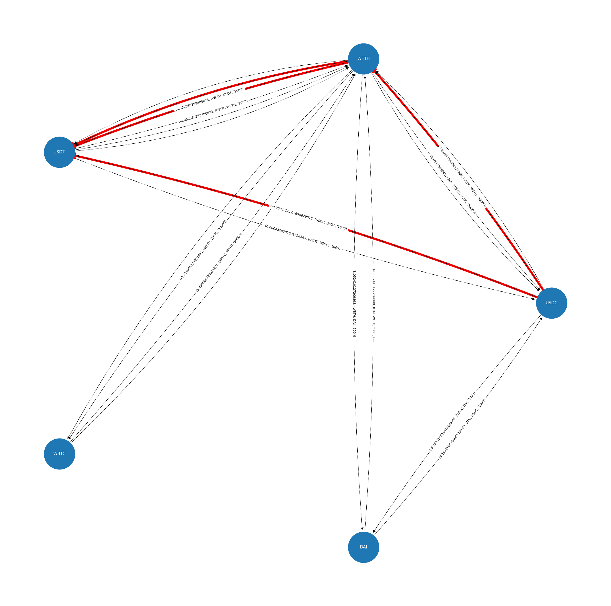

# Defi Graph


This is package for creating and visualizing graphs in DeFi protocols.



## Install

Install using pip or uv

```sh
pip install defigraph

# or using uv

uv add defigraph
```

## Development

Install [uv package manger](https://docs.astral.sh/uv/):

```sh
curl -LsSf https://astral.sh/uv/install.sh | sh
```

Clone project

```sh
git clone https://github.com/mmsaki/defigraph.git
```

Create virtual environment, and activate

```sh
uv venv;
source .venv/bin/activate;
```

Install dependencies

```sh
uv sync
```

## Modules

- [x] [Edge](#edge-type) - describes a path between tokens
- [x] [Vertex](#vertex-type) - describes a token
- [x] [Graph](#graph-type) - describes a defi market
- [x] [Pool](#pool-type) - describes trading token pairs

## Edge type

Edges store two main state:

1. `self.weight` - a weight between two tokens
   - typeof `Decimal`
   - `{0,1}` Depends on direction of edge
   - Calculated as `-Math.log(self.pool.token_price_{0,1})`
2. `self.pool` - an instance of a token pool
   - typeof `Pool`
3. `self._tuple` - Allows indexing/iteration of the edge object
   - typeof `iter`
   - Array of `[Vertex1, Vertex2, (self.weight, Pool)]`

## Pool type

A pool object describing tokens:

1. `self.address` - the address of the pool
   - typeof `Hex` checksum address
2. `self.token0` - a token described as a vertex
   - typeof `Vertex`
3. `self.token1` - a token described as a vertex
   - typeof `Vertex`
4. `self.token0_price` - the price of token0
   - typeof `Decimal`
5. `self.token1_price` - the price of token1
   - typeof `Decimal`
6. `self.fee` - describes the pool fee e.g Uniswap (100 | 500 | 1000 | 3000)
   - typeof `int`

## Graph type

An adjacency list graph object desribing a defi market

1. `self.vertices` - contains a list of all vertices
   - typeof `List[Vertex]`
2. `self.adjascency_list` - a mapping describing edges in the graph
   - typeof `Dict[Vertex, List[Edge]]`
   - example: {Vertex: [Edge1, Edge2, Edge3, Edge4]}

## Vertex type

A node on the graph describing a token

1. `self.name` - name of the token
   - typeof `string`
2. `self.decimals` - number of decimals for token
   - typeof `int`
3. `self.address` - address of token
   - typeof `Hex` checksum address

## Tests

Run tests using pytest watcher:

```sh
ptw .
```

## Example

See example in [docs/notebooks/graph.ipynb](./docs/notebooks/graph.ipynb)
